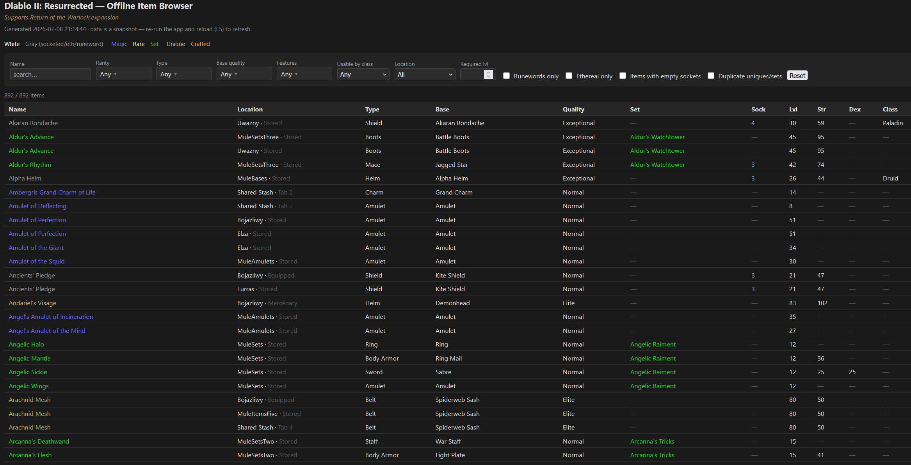

# D2RItemInspector

Browse and filter **every item** across all your offline Diablo II: Resurrected characters and the
shared stash, in one self-contained web page. Works with **Return of the Warlock** characters too.

## Download

Grab the latest ready-to-run **`D2RItemInspector.exe`** from the
[**Releases** page](../../releases/latest) — a single self-contained Windows (x64) executable, no
.NET install required. Download it, put it anywhere, and double-click: it reads your live save folder
and opens the item report in your browser.

Prefer to build from source? See [Build & run](#build--run) below.

## What it does

Parses Diablo II: Resurrected save files and, by default, generates a self-contained **`items.html`**
report (all data embedded, no server or internet needed to view it) and opens it in your browser:

- **Characters** (`.d2s`) — inventory, corpse, mercenary and golem items.
- **Shared stash** (`.d2i`) — every tab.
- Supports both **RotW** (*Return of the Warlock*, a full-scale D2R expansion, save version `0x69`,
  including the new **Warlock** class) and **pre-RotW** vanilla D2R characters (version `0x62`).

Run with `--print` instead to get the old plain-text console report.

## The HTML report

A sortable, filterable table of all your equipment (weapons, armor, jewelry, charms, jewels).
Consumables/gems/runes-in-stash are listed as items but the report focuses on equipment.



**Columns & display**
- **Name**, colored by rarity (white / gray for socketed·ethereal·runeword / blue magic / yellow
  rare / gold unique / green set / orange crafted). Runewords show the runeword name.
- Type, Base, Base quality, Set, Sockets, Required level/str/dex, allowed class, ethereal flag, and
  the item's location (which character/stash tab, and whether equipped/stored/corpse/merc/golem).
- Click any column header to sort.

**Hover tooltips**
- **Item name** → the item's magical properties, formatted like in-game (skills, resistances,
  per-level bonuses, auras, etc.). Weapons show their base damage; combined lines such as
  *"+X to All Attributes"* and *"All Resistances +X%"* are merged like the game does.
- **Set name** → the set's whole-set info: an *(x / n Items)* collection counter (green when you own
  the full set, yellow when partial), a **Missing:** list of the pieces you don't have yet, and the
  set bonuses grouped under **2 / 3 / … Item Bonuses** and **Full Set Bonuses** headers.
- **Sockets** → what's in each socket (runes/gems/jewels), with open sockets shown as *empty*.

**Links & shortcuts**
- Unique, set and runeword names link to their **diablo.fandom.com** wiki page (opens in a new tab).
  Links are verified against the wiki's API before being added (missing pages get no link), and the
  results are cached in `.wiki-link-cache.json` so re-runs don't hit the network.
- Click a **set name** to filter the list to just that set (click again, or the *clear* link, to undo).

**Filters** (all client-side, combine freely)
- Name search, Rarity, Type (with an *All weapons* toggle), Base quality, **Features** (a multi-select
  of common properties — resistances, faster cast rate, crushing blow, +to attributes, indestructible,
  …), Usable-by-class, Location, and maximum Required level.
- Checkboxes: **Runewords only**, **Ethereal only**, **Items with empty sockets**, **Duplicate
  uniques/sets**.

The page is a point-in-time snapshot — re-run the app and reload (F5) to refresh after playing.

## Requirements

- **.NET 10 SDK** — to build/run the app (`D2RItemInspector.csproj` targets `net10.0`).
- **.NET 6 SDK** — to build the bundled `D2SLib` library (targets `net6.0`).

Check what you have with `dotnet --list-sdks`.

## Build & run

> **Important:** the app references the `D2SLib` library as a prebuilt DLL (via `HintPath`), so you
> **must build the library in Release first**. The app won't compile until that DLL exists.

```sh
# 1. Build the library (Release, net6.0)
dotnet build D2SLib-D2R/src/D2SLib.csproj -c Release -f net6.0

# 2. Build & run the app -> writes items.html and opens it in your browser
dotnet run -c Release

# ...or print the plain-text report to the console instead
dotnet run -c Release -- --print
```

If you edit anything under `D2SLib-D2R/src`, re-run step 1 before re-running the app (the DLL is not
rebuilt automatically).

## Saves it reads

The app reads **every** `.d2s` and `.d2i` file directly from your live D2R save folder:

```
%USERPROFILE%\Saved Games\Diablo II Resurrected
```

so the report always reflects your current game state — just exit to the menu (so the game flushes
the files) and re-run / refresh. The path is a constant in `Program.cs` (`saveDirPath`); change it
there if your saves live elsewhere. Each file is parsed independently — if one can't be read it's
reported and the run continues.

## Using it from another app

Item collection is separate from the report rendering, so you can consume the data directly.
`SaveInspector.Collect()` returns an `InspectionResult` — dictionaries of `CharacterData` /
`StashData` keyed by file name:

```csharp
string saveDir = Environment.ExpandEnvironmentVariables(@"%USERPROFILE%\Saved Games\Diablo II Resurrected");
var inspector = new SaveInspector(saveDir, @"D2SLib-D2R\src\Resources");
InspectionResult result = inspector.Collect();

CharacterData elza = result.Characters["Elza.d2s"];
foreach (ItemData item in elza.Inventory)
    Console.WriteLine($"{item.Name} x{item.Quantity}");
```

`HtmlReport.Write(result, "items.html")` renders the browsable page; `ConsoleReportRenderer.Print(result)`
renders the text report.

## Project layout

App source lives under `src/`, grouped by responsibility:

| Path | Purpose |
|------|---------|
| `src/Program.cs` | Entry point: collect → write/open `items.html` (or `--print` the console report) |
| `src/Model/InspectionModel.cs` | Data model (`CharacterData`, `StashData`, `ItemData`, …) |
| `src/SaveInspectors/SaveInspector.cs` | Public API: scans the save dir, returns `InspectionResult` |
| `src/SaveInspectors/CharacterInspector.cs` · `SharedStashInspector.cs` | Read one `.d2s` / `.d2i` into data |
| `src/ItemEnrichment/ItemMapping.cs` · `ItemEnricher.cs` | Map a parsed item to the report model (rarity, type, req level, sockets, features, …) |
| `src/ItemEnrichment/ItemNameResolver.cs` · `StringTable.cs` | Name resolution (unique/set/runeword/magic/rare) via the game string tables |
| `src/ItemEnrichment/StatFormatter.cs` | Turns raw item stats into readable in-game-style mod lines |
| `src/ItemEnrichment/SetBonusResolver.cs` | Whole-set bonuses (partial + full-set) for the Set tooltip |
| `src/Report/WikiLinker.cs` | Adds & verifies diablo.fandom.com links for uniques/sets/runewords |
| `src/Report/ItemReport.cs` | Flattens an `InspectionResult` into equipment report rows |
| `src/Report/HtmlReport.cs` | Renders the self-contained, filterable `items.html` |
| `src/Report/ConsoleReportRenderer.cs` | Renders an `InspectionResult` to the console (`--print`) |
| `D2SLib-D2R/` | Vendored, modified [D2SLib](https://github.com/locbones/D2SLib-D2R) with RotW + pre-RotW parsing support |

### Notes

- RotW and pre-RotW saves use different game data tables, so the library embeds both sets and picks
  the right one per save version (RotW = `Resources/*.txt`, pre-RotW = `Resources/Legacy_*.txt`).
- Pre-RotW item base names may be spelled slightly differently (e.g. *"Charm Small"* vs *"Small
  Charm"*) — that's just the older data table's text, not a parsing error.
- Because RotW is its own expansion, some item stats intentionally differ from vanilla D2 (and from
  the vanilla-focused wiki) — those differences are expected, not bugs.
- `items.html` is written next to the app when it runs. The wiki-link existence cache is kept out of
  the way in `%LOCALAPPDATA%\D2RItemInspector\wiki-link-cache.json` (delete it to force a re-check).
